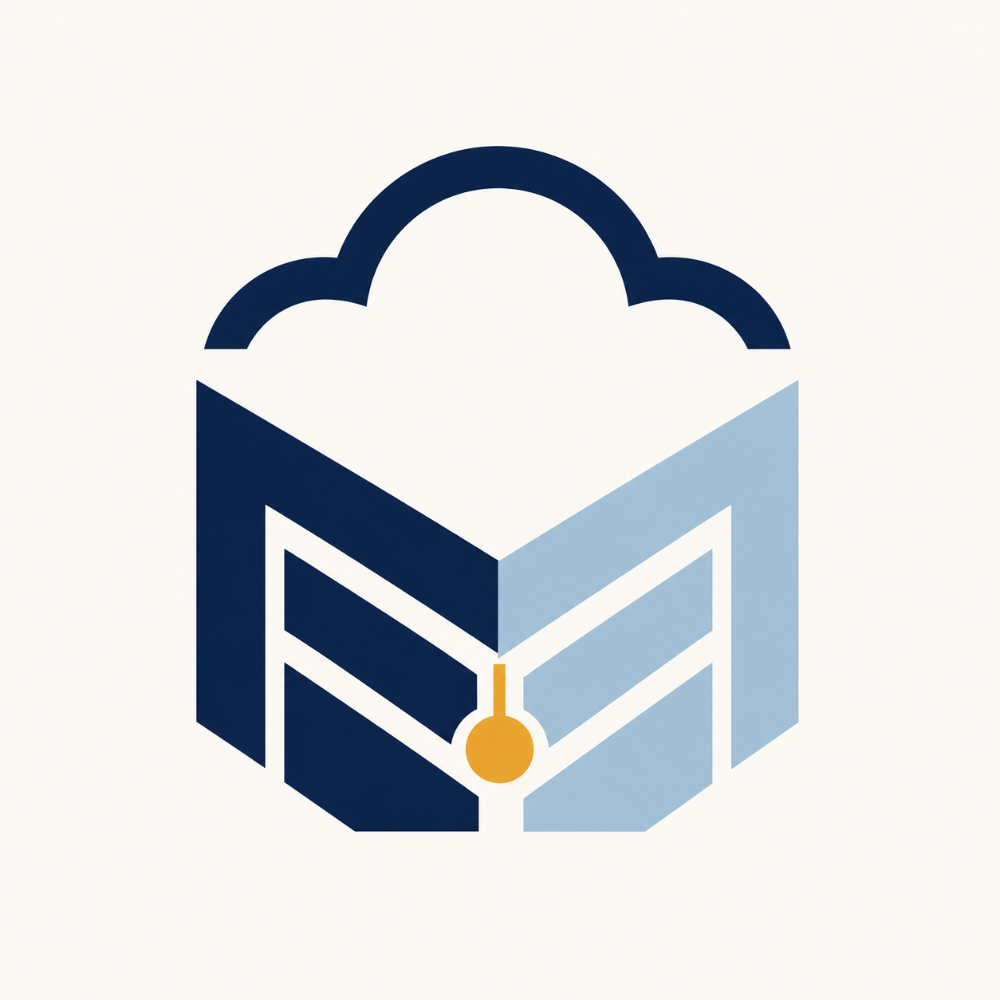
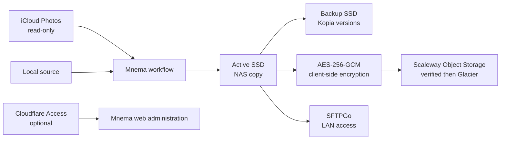

<p align="center">
  
</p>

<h1 align="center">Mnema</h1>

<p align="center"><strong>Your cloud, remembered.</strong></p>

<p align="center">
  
  
  
</p>

Mnema is a self-hosted personal cloud archiving appliance for Raspberry Pi 5. It imports
files into active NAS storage, creates a versioned local backup, writes a client-side
encrypted off-site archive, and verifies every copy independently before advancing its
durable workflow.

The project favors recoverability over convenience. Automatic source deletion is
disabled, iCloud deletion is not implemented, cloud deletion is not implemented, and an
upload is never considered a backup until Mnema restores and hashes it.

## What Mnema provides

| Boundary | Implementation |
| --- | --- |
| Source import | Local filesystem and read-only iCloud Photos |
| Active storage | Streamed staging, SHA-256 verification, atomic commit and fsync |
| Local backup | Kopia snapshot with independent restore verification |
| Off-site archive | AES-256-GCM encrypted S3/rclone transport |
| Deep archive | Verified Standard upload followed by confirmed Scaleway Glacier transition |
| File access | SFTPGo with access only to active storage |
| Administration | Mobile-first web UI and unified `mnema` CLI |
| Internet access | Optional Cloudflare Tunnel and Access JWT validation |
| Recovery | Durable SQLite state, leases, audit events, restore tests and startup reconciliation |

Mnema coordinates established storage tools; it does not replace Kopia, SFTPGo, rclone,
Cloudflare, disk management, or the provider's object-storage service.

## How the archive works



For every eligible item Mnema:

1. Discovers stable source metadata and evaluates policy.
2. Streams into a staging file while calculating SHA-256.
3. Atomically commits the active copy and verifies it again.
4. Creates a Kopia snapshot and verifies a temporary restore.
5. Encrypts the off-site object with AES-256-GCM.
6. Uploads, downloads, decrypts, and verifies the remote plaintext hash.
7. For Scaleway, transitions only that verified object to `GLACIER` and confirms the
   storage class.
8. Records immutable audit events and enters quarantine.

External operations use deterministic identifiers and are retryable. State transitions
and audit records are committed together. Files are streamed rather than loaded into
memory, symlinks are rejected, and configured paths must remain beneath trusted roots.

## Hardware and operating system

The supported appliance target is:

- Raspberry Pi 5, ARM64, with at least 4 GB RAM.
- Debian ARM64 or Raspberry Pi OS Lite 64-bit.
- Ethernet recommended.
- Two separately mounted filesystems identified by UUID:
  - active NAS storage;
  - Kopia versioned backup storage.
- Docker Engine with Compose v2.

Mnema never formats disks and never persists `/dev/sdX` names. The installer rejects
missing mounts, identical device identities, unsafe permissions, unsupported platforms,
and failed Compose validation.

## Appliance installation

Start from a reviewed Mnema release on the Raspberry Pi with both storage filesystems
already formatted and mounted:

```bash
sudo ./scripts/bootstrap-cli.sh
sudo mnema install --source-root "$PWD"
sudo mnema configure
sudo mnema startup
mnema urls
```

`mnema configure` is the guided wizard. Individual boundaries can be configured later:

```bash
sudo mnema configure storage
sudo mnema configure cold-storage
sudo mnema configure cloudflare
sudo mnema configure icloud
sudo mnema configure sftpgo
sudo mnema configure policy
```

Non-secret desired state lives in `/etc/mnema/config.yaml`. Secrets are separate
root-owned files under `/etc/mnema/secrets`; CLI previews and configuration output redact
their locations and identity values.

## Scaleway Glacier

Create a private bucket and scoped credentials in Scaleway first. Glacier is supported
in Paris (`fr-par`) and Amsterdam (`nl-ams`):

```bash
sudo mnema configure cold-storage \
  --provider scaleway \
  --region fr-par \
  --s3-bucket YOUR_EXISTING_BUCKET \
  --s3-access-key-file /safe/input/access-key \
  --s3-secret-key-file /safe/input/secret-key \
  --yes
```

Mnema uploads in Standard class so it can perform an independent download/decrypt/hash
verification. It then changes the same encrypted object to `GLACIER`, using multipart
server-side copy for large files, and confirms the final storage class. It does not
create or delete buckets, delete objects, or add expiration rules.

Glacier retrieval is asynchronous. The first remote restore submits `RestoreObject` and
records a pending audit result. Retry from the restore page after Scaleway finishes
retrieval. See [Scaleway Glacier](docs/SCALEWAY_GLACIER.md).

## iCloud Photos

Mnema supports one dedicated Apple account and Personal Library:

```bash
sudo mnema configure icloud
sudo mnema icloud auth
sudo mnema icloud preview
sudo mnema icloud sync
sudo mnema icloud status
```

Authentication and two-factor verification are interactive. Mnema stores protected
session cookies, but no Apple password or 2FA code. The first successful manual sync
arms the daily timer. Imports include original photos, videos, RAW assets, and Live Photo
components.

iCloud web access must be enabled and Advanced Data Protection must be disabled for the
pinned web-access client. iCloud Drive, Shared Library, multiple accounts, and all
iCloud deletion are unsupported. See [iCloud limitations](docs/ICLOUD_LIMITATIONS.md).

## Cloudflare and service URLs

Mnema can use an existing remotely managed Cloudflare Tunnel:

```bash
sudo mnema configure cloudflare
mnema urls
mnema urls --json
```

Mnema stores the tunnel token and validates Cloudflare Access JWTs on a dedicated public
web service. It does not create the Cloudflare application, policy, DNS record, or
published hostname. The localhost recovery web service remains separate, while SFTP
remains LAN-only.

`mnema urls` reports the configured Cloudflare URL when enabled; otherwise it reports
the actual local bind and SSH-tunnel guidance. It also lists reachable SFTP endpoints and
marks services `running`, `stopped`, or `unknown`.

## CLI overview

```text
mnema install                         Install and validate the appliance
mnema startup                         Enable at boot and start now
mnema start|stop|restart              Control the stack
mnema configure                       Run the guided configuration
mnema config show|validate|diff       Inspect desired state safely
mnema urls [--json]                   Show reachable service endpoints
mnema icloud auth|preview|sync|status Manage read-only iCloud imports
mnema backup create PATH              Back up configuration and secrets
mnema restore config PATH             Restore configuration safely
mnema update                          Install a verified release archive
mnema rollback                        Restore the previous release
mnema status                          Show archive and job state
mnema scan [--archive]                Discover and optionally archive items
mnema dry-run                         Preview policy decisions
mnema verify                          Verify recorded active files
mnema diagnostics                     Run non-destructive diagnostics
mnema pause-deletion                  Close the global deletion gate
mnema resume-deletion                 Re-evaluate every safety prerequisite
```

See the [complete CLI guide](docs/CLI.md).

## Safety model

- Source deletion is globally disabled and safety-locked by default.
- iCloud and cloud-storage adapters expose no deletion capability.
- No route or adapter can bypass `DeletionSafetyGate`.
- Active and backup storage must resolve to different filesystem identities.
- Missing mounts fail closed instead of silently writing to the system disk.
- Every state change has an audit event in the same database transaction.
- Cold objects are encrypted before leaving the appliance.
- Restore verification compares plaintext SHA-256, not only provider metadata.
- Destructive tests use temporary directories and require `MNEMA_ALLOW_TEST_DELETE=1`.

Production source deletion remains a separate, explicitly reviewed future milestone.

## Configuration backup and recovery

Configuration backups contain secrets and must be protected:

```bash
sudo mnema backup create /safe/path/mnema-config.tar.gz
sudo mnema restore config /safe/path/mnema-config.tar.gz
```

Startup checks validate SQLite integrity, storage mounts, device separation, writable
roots, partial files, expired leases, backup availability, remote availability, and
SMART health when required. Interrupted destructive states move to manual review.

Read the [recovery guide](docs/RECOVERY.md) before treating the appliance as the only
copy of important data.

## Local development

Requires Python 3.12+:

```bash
python3 -m venv .venv
. .venv/bin/activate
python -m pip install -e '.[dev]'
python -m playwright install chromium

ruff check .
ruff format --check .
mypy src
pytest
```

For local Docker integration:

```bash
cp deploy/compose/.env.example .env
mkdir -p data/{active,backup,staging,test-source} secrets
openssl rand -base64 48 > secrets/mnema_secret_key
openssl rand 32 > secrets/mnema_cold_key
docker compose --profile integration up --build
```

MinIO proves S3 protocol behavior only; it is not an off-site backup.

## Current limitations

- Physical power-loss testing on final hardware remains outstanding.
- Live Scaleway Glacier upload/transition/restore requires operator credentials and is
  not exercised by the test suite.
- iCloud behavior depends on Apple's private web interfaces and may require periodic
  reauthentication.
- OpenMediaVault integration is not yet implemented.
- The web UI is an administration shell, not a general file browser or photo manager.

See [implementation status](docs/IMPLEMENTATION_STATUS.md) for validated hardware,
external-service, browser, stress, and recovery evidence.

## Documentation

- [Architecture](docs/ARCHITECTURE.md)
- [Appliance CLI](docs/CLI.md)
- [Installation](docs/INSTALLATION.md)
- [Storage](docs/STORAGE.md)
- [Scaleway Glacier](docs/SCALEWAY_GLACIER.md)
- [Cloudflare](docs/CLOUDFLARE.md)
- [iCloud limitations](docs/ICLOUD_LIMITATIONS.md)
- [Recovery](docs/RECOVERY.md)
- [Threat model](docs/THREAT_MODEL.md)
- [Stress testing](docs/STRESS_TESTING.md)
- [Implementation status](docs/IMPLEMENTATION_STATUS.md)
- [Security policy](SECURITY.md)

## License

Apache License 2.0. See [LICENSE](LICENSE).

Mnema is not affiliated with Apple, Cloudflare, Scaleway, SFTPGo, Kopia, rclone, MinIO,
OpenMediaVault, or Raspberry Pi.
